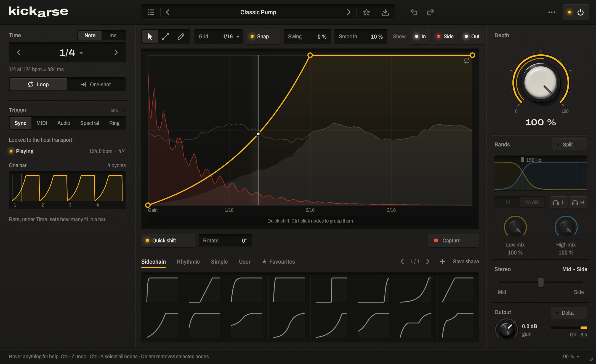
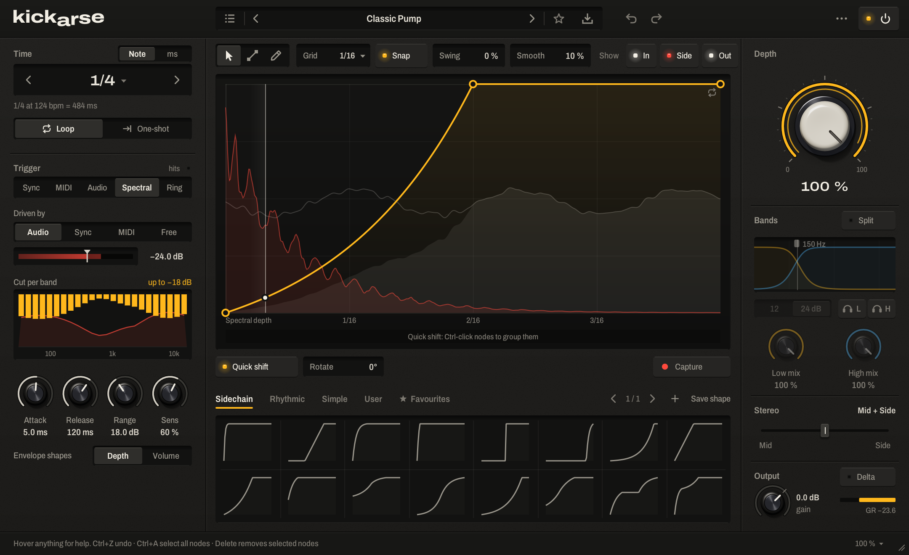
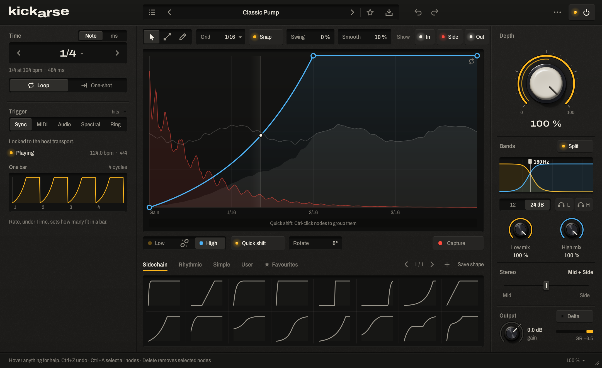
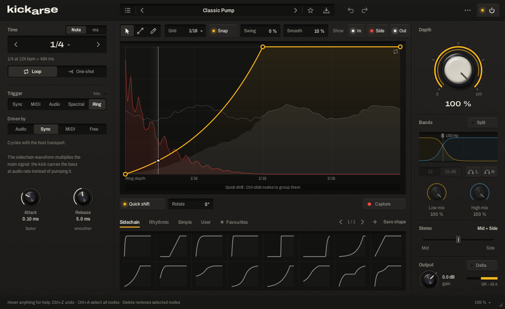
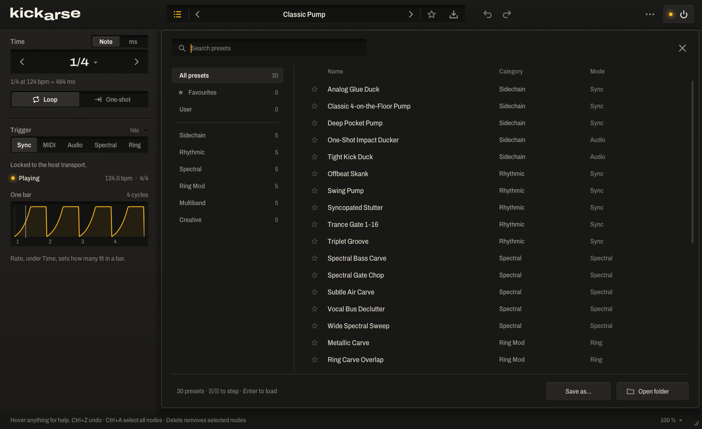

# Kickarse - The Best Open-Source Sidechain Plugin

Sidechain / ducking plugin for Windows — VST3, VST2 and CLAP, 64-bit.
Five modes: **Sync**, **MIDI**, **Audio**, **Spectral** (24-band inverse EQ) and **Ring** (sidechain ring modulation),
with a drawable envelope, low/high split, Mid/Side, Delta monitoring, Quick Shift and audio → envelope capture.

<p align="center">
  
</p>

## Features

**Five modes**
- **Sync**: locks to the host tempo, no sidechain input needed.
- **MIDI**: triggered by notes into the plugin, with note filtering and velocity sensitivity.
- **Audio**: triggered by transients in the sidechain, with threshold, hold-off and a trigger filter.
- **Spectral**: a 24-band inverse EQ that only cuts the frequencies competing with the sidechain, at zero latency.
- **Ring**: sidechain ring modulation, multiplies the main signal by the sidechain waveform for a fast, audio-rate carve.

**Envelope editor**
- Draw and edit nodes with per-segment curvature, straight-line and freehand tools, grid snap and swing.
- **Quick Shift** moves the dip and recovery together in one drag.
- **Capture** records the incoming sidechain and turns it into an editable duck shape you can save and reuse.
- Waveform overlay behind the curve (input and sidechain), full undo and redo.

**Multiband**
- Split into low and high bands at an adjustable crossover, 12 or 24 dB per octave.
- Each band gets its own envelope and mix amount. **Link** makes them move together, or solo either one.

**Monitoring and routing**
- **Delta** monitoring: hear only what got removed.
- Mid/Side blend, from mid-only to side-only.
- Sidechain trigger filter with a listen switch, handy for isolating a kick from a full drum bus.

**Presets**
- 30 factory presets across six categories: Sidechain, Rhythmic, Spectral, Ring Mod, Multiband and Creative.
- Full presets save every parameter and envelope; the shape library saves envelopes alone so they work across modes.
- Favourites, search, and your own presets saved under User.

## Screenshots

<table>
  <tr>
    <td align="center" width="50%">
      <br>
      <sub><b>Spectral</b>: reversed EQ ducks only the bands competing with the kick</sub>
    </td>
    <td align="center" width="50%">
      <br>
      <sub><b>Multiband</b>: split low/high, each band with its own envelope</sub>
    </td>
  </tr>
  <tr>
    <td align="center" width="50%">
      <br>
      <sub><b>Ring</b>: sidechain ring modulation for a fast, audio-rate carve</sub>
    </td>
    <td align="center" width="50%">
      <br>
      <sub><b>Presets</b>: 30 factory presets across six categories</sub>
    </td>
  </tr>
</table>

## Install

Run `dist\Kickarse-Setup.exe` and tick the formats you want. It asks for admin rights because plugin folders live in Program Files.

| Format | Installed to |
|--------|--------------|
| VST3 | `C:\Program Files\Common Files\VST3\Kickarse.vst3` |
| VST2 | `C:\Program Files\Common Files\VST2\Kickarse.dll` (you can pick another folder) |
| CLAP | `C:\Program Files\Common Files\CLAP\Kickarse.clap` |

Your own presets and shapes go to `Documents\Kickarse\` and are never touched by the uninstaller.
Uninstall from *Settings → Apps* ("Kickarse"). No admin? `installer\Install Kickarse.bat` does the same copy with PowerShell.

After installing, rescan plugins in your DAW. Use **one** format per project (VST3 is the best choice in all three DAWs;
CLAP also works in Bitwig and FL Studio).

## Sidechain setup

Put Kickarse on the track you want to duck (bass, pads, bus) and feed the kick into its sidechain input.
Menu names can differ slightly between DAW versions.

**Bitwig Studio** — add Kickarse to the bass track. In the plugin device's header open the **sidechain** selector and
choose the kick track (pre/post fader as you like). For **MIDI** mode, route notes to the plugin
(e.g. a *Note Receiver* on the bass track pointing at the kick's MIDI clip track).

**FL Studio** — put Kickarse on the bass mixer insert. Select the kick's insert, then right-click the routing arrow of
the bass insert → **Sidechain to this track**. Open the plugin wrapper's ⚙ **Processing** tab and set the plugin's
sidechain input to the kick insert. For **MIDI** mode, give the wrapper a MIDI input port and send notes from a
*MIDI Out* channel on the same port.

**Ableton Live (11/12)** — put Kickarse on the bass track, click the small **sidechain** toggle in the device title bar and choose the kick
track as the audio source. For **MIDI** mode, set a MIDI track's *MIDI To* to the bass track → Kickarse.
For VST2 in Ableton, enable *Use VST Plug-in Custom Folder* and point it at your VST2 folder.

**Sync** mode needs no sidechain: it locks to the host tempo. **Audio**, **Spectral** and **Ring** modes listen to the
sidechain; use **Trigger filter** (e.g. 20–150 Hz) to pick the kick out of a full drum bus, and **Listen** to hear it.

## Quick tips
- Double-click or Ctrl-click resets a control; Alt-click types a value; Shift-drag is fine adjustment.
- Editor: drag nodes, drag a segment to bend it, double-click to add/delete, drag empty space to marquee.
  Ctrl-click nodes to add them to the **Quick Shift** group, then slide the bar under the editor.
- **Capture** records one cycle of the sidechain and turns it into an editable duck shape (saved under *User*).
- **Delta** lets you hear only what Kickarse removes.

## Building from source
Needs Visual Studio 2022 Build Tools (C++), CMake ≥ 3.22 and git.

```
powershell -ExecutionPolicy Bypass -File build.ps1              # plugins -> dist\
powershell -ExecutionPolicy Bypass -File installer\build-installer.ps1 -PayloadDir dist
```

Built with [DPF](https://github.com/DISTRHO/DPF) (ISC). VST2 support uses DPF's clean-room VST2 header
(no Steinberg VST2 SDK). Fonts: Archivo (SIL Open Font License).

## Contributing

Bug reports, feature ideas and pull requests are welcome — see
[CONTRIBUTING.md](CONTRIBUTING.md) for how to get set up and what to expect.

## License

Kickarse is Copyright © 2026 Alexis Alberto Zúñiga Alonso, licensed under
[GPL-3.0](LICENSE). You're free to use, study, modify and redistribute it —
modified versions must stay open under the same license and keep the
original copyright notice.

Contact: [alexisalbertoza@gmail.com](mailto:alexisalbertoza@gmail.com)
